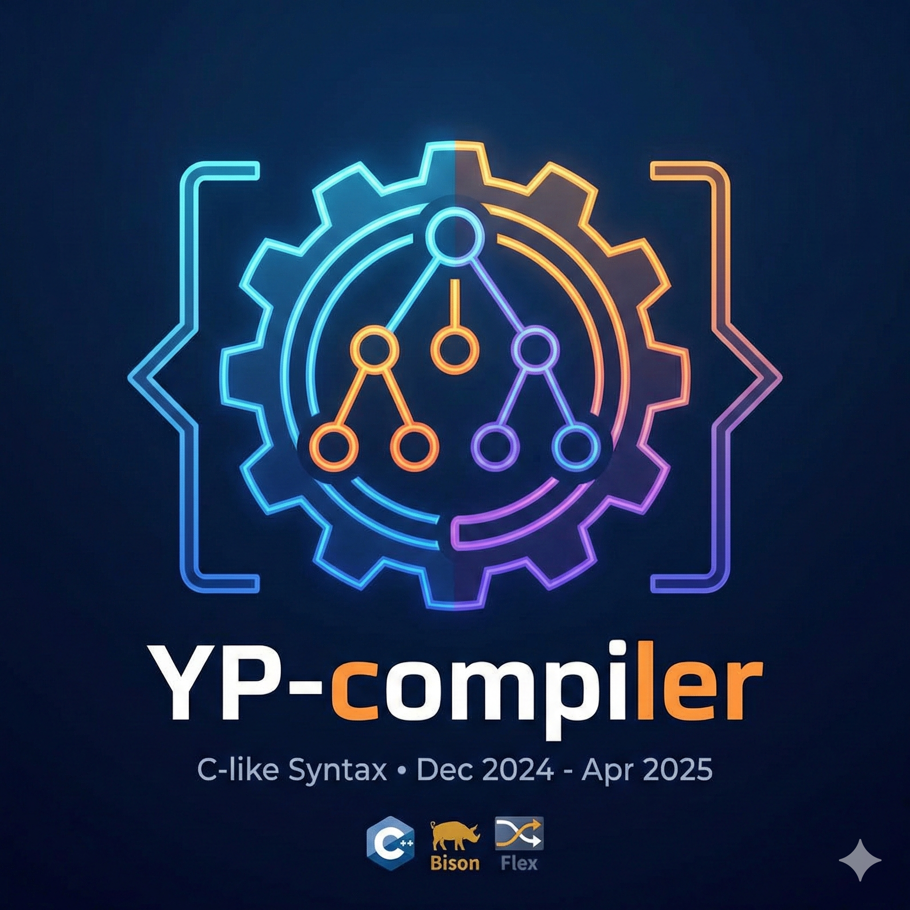

  
  <h1>YP compiler</h1>
  
  

    A custom compiler that reads, parses, and executes source code written in a specialized C-like syntax, utilizing Flex for text recognition. Test-driven development principles were considered in this project.
  

  

    
    
    
    
    
    
  

   
  <h4>
      <a href="./docs/Tema2024-25.pdf">System requirments</a>
     · 
      <a href="https://github.com/petru-braha/YP-compiler/issues/">Report Bug</a>
     · 
      <a href="https://github.com/petru-braha/YP-compiler/issues/">Request Feature</a>
     · 
      <a href="./docs/README%20RO.md">Romanian documentation</a>
  </h4>

## Usage

- for improved redability, we recommand VS Code and the "Better Comments" extension
- commands to be passed in project root terminal:

0. "./setup.sh" - checks for bison and flex installation and builds our compiler
1. "./build.sh" - builds the custom compiler
2. "./src/discard.sh" - delete the additional files
3. "./run.out <file_path>" - compiles and runs the source code

## Technologies

0. C++
1. Flex
2. Yacc/Bison

## Features

- All variables/parameters/objects have:
  - explicit value(s)
  - implicit value(s) if there is no given definiton
    - e. g. 0, 0.0, '0', "", true
  - no container will ever be "undefined"

- x-dimensional arrays, where x could be any natural value not NULL. the same is assured for the size of each dimension.

- Each file from [examples directory](/exs/) is responsable of one grammar rule.

- See [implementation details](/docs/brainstorm.md) for more.

- Default parameters for functions

## Limitations

- No type qualifiers
- No pointers, refferences
- No struct, union
- No inheritence of classes
